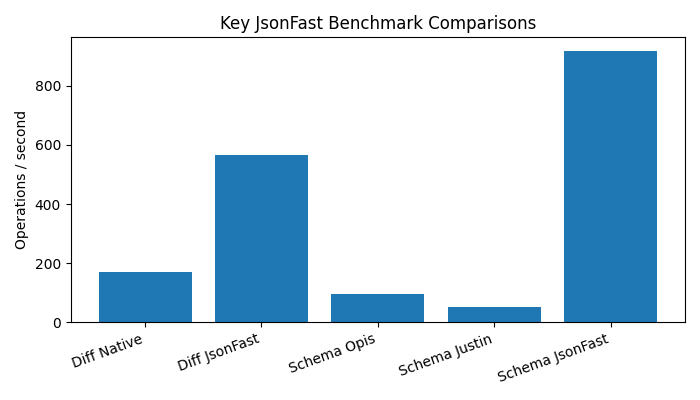
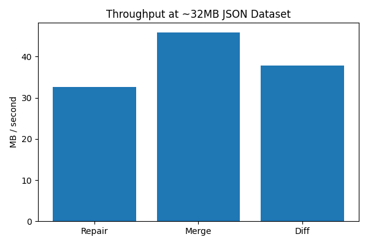
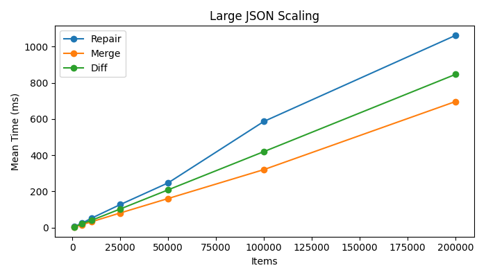

# php_jsonfast

[Features](#features) | [Why JsonFast](#why-jsonfast) | [Performance](#performance)
| [API](#api) | [Quick Start](#quick-start) | [Install via Package](#install-via-package)
| [Building](#build-and-install-from-source) | [Docker](#docker-usage) | [Testing](#testing) | [Benchmarks](#benchmarks)

`php_jsonfast` is a PHP extension written in Rust that provides fast JSON parsing, repair, formatting, path access, schema validation, merge/diff, and flexible output modes — returning native PHP arrays, JSON strings, or `stdClass` objects.

✔ Repair malformed JSON (comments, JSONP, trailing commas, and more)

✔ Dot-path and wildcard path access

✔ Beautify, minify, merge, and diff

✔ Schema inference, validation, and application

✔ Flexible output: array, string, or object

✔ Built on `serde_json` with order-preserving object keys

## Features

- **Repair** broken JSON from real-world sources (JavaScript literals, JSONP wrappers, BOM, comments)
- **Analyse** invalid JSON and get suggested repair flags before fixing
- **Format** JSON with configurable indentation or compact minification
- **Path access** with dot notation and wildcards (`user.name`, `users[*].email`)
- **Transform** documents with deep merge and structural diff
- **Schema** infer, validate, apply defaults, and diff schemas
- **Output modes** on every data-returning method: PHP array (default), JSON string, or `stdClass` object

## Why JsonFast?

Most PHP JSON workflows combine `json_decode()`, manual array walking, and third-party libraries for repair and schema validation. `php_jsonfast` consolidates these into a single Rust-backed extension:

- One API for parse, repair, format, path, merge, diff, and schema operations
- Repair logic for common non-standard JSON (not supported by `json_decode()`)
- Path queries without decoding the full document into PHP first
- Schema validation without pulling in a separate Composer dependency
- Consistent output mode control across all methods
- Lower overhead on large payloads compared to multi-step PHP pipelines

## Performance

> Benchmarks were run on synthetic JSON payloads in Docker (`php:8.3-cli-bookworm`). Results depend on hardware, payload size, PHP version, and runtime environment. These figures are project-level reference numbers, not universal guarantees.

Run benchmarks locally:

```bash
make benchmark

# custom run: iterations, medium payload items, max capacity items
make benchmark BENCH_ITERATIONS=1000 BENCH_ITEMS=500 BENCH_CAPACITY=200000
```

### Core operation comparisons

[](.github/images/jsonfast_core_benchmarks.png)

| Operation | Implementation | Ops/sec |
| --- | --- | ---: |
| Diff | Native PHP | ~170 |
| Diff | JsonFast | ~570 |
| Schema validation | opis/json-schema | ~100 |
| Schema validation | justinrainbow/json-schema | ~50 |
| Schema validation | JsonFast | ~920 |

JsonFast diff is roughly **3.3× faster** than the native PHP helper in this benchmark. Schema validation is roughly **9× faster** than Opis and **18× faster** than JustinRainbow on the medium test document.

---

### Repair / merge / diff throughput

[](.github/images/jsonfast_throughput.png)

Measured on a ~32 MB broken/repairable JSON payload (200k items):

| Operation | Throughput |
| --- | ---: |
| Repair | ~33 MB/sec |
| Merge | ~46 MB/sec |
| Diff | ~38 MB/sec |

---

### Large JSON scaling

[](.github/images/jsonfast_scaling.png)


Capacity benchmark from 1k → 200k items (mean time, ms):

| Items | Repair | Merge | Diff |
| ---: | ---: | ---: | ---: |
| 1,000 | ~5 | ~2 | ~3 |
| 50,000 | ~250 | ~160 | ~210 |
| 100,000 | ~590 | ~320 | ~420 |
| 200,000 | ~1,060 | ~700 | ~850 |

All three operations scale roughly linearly with document size in this test.

---

The benchmark suite compares `JsonFast` against native PHP and popular libraries where applicable:

| Category | Compared against |
| --- | --- |
| Repair | JsonFast throughput (files/sec, MB/sec) |
| Encode / beautify / minify | `json_encode()` |
| Path access | `json_decode()` + manual traversal |
| Merge / diff | Native PHP helpers |
| Schema validation | [opis/json-schema](https://github.com/opis/json-schema), [justinrainbow/json-schema](https://github.com/JustinRainbow/json-schema) |

Reported metrics:

| Metric | Description |
| --- | --- |
| Ops/sec | Operations completed per second |
| Mean / P95 | Average and 95th percentile latency (ms) |
| Files/sec | Repair throughput by document count |
| MB/sec | Repair throughput by input payload size |
| Peak memory | Peak allocated memory during benchmark |
| Large JSON capacity | Scaling test from 1k → 200k nested records |

---

# API

> View the full docs [here](https://skullfire.co.uk/libphp-jsonfast/)

## Class: `JsonFast`

All methods are static. Data-returning methods accept an optional `$output` argument.

### Output constants

| Constant | Value | Returns |
| --- | ---: | --- |
| `JsonFast::OUTPUT_ARRAY` | `0` | PHP array (default) |
| `JsonFast::OUTPUT_STRING` | `1` | Compact or formatted JSON string |
| `JsonFast::OUTPUT_OBJECT` | `2` | `stdClass` for JSON objects |

### Repair constants

| Constant | Description |
| --- | --- |
| `REPAIR_BOM` | Strip UTF-8 byte order mark |
| `REPAIR_JSONP` | Strip JSONP wrapper (`callback(...)`) |
| `REPAIR_COMMENTS` | Remove `//` and `/* */` comments |
| `REPAIR_TRAILING_COMMAS` | Remove trailing commas |
| `REPAIR_DOUBLE_ENCODED` | Unwrap double-encoded JSON strings |
| `REPAIR_UNQUOTED_STRINGS` | Quote unquoted string values |
| `REPAIR_SINGLE_QUOTES` | Convert single quotes to double quotes |
| `REPAIR_UNQUOTED_KEYS` | Quote unquoted object keys |
| `REPAIR_ALL` | All repair flags combined |

---

### `validate(string $json): bool`

Returns `true` if the input is valid JSON.

---

### `repair(string $json, ?int $flags = REPAIR_ALL, ?int $output = OUTPUT_ARRAY): mixed`

Repairs malformed JSON using the specified flag bitmask.

```php
$fixed = JsonFast::repair($broken, JsonFast::REPAIR_ALL, JsonFast::OUTPUT_STRING);
```

---

### `analyse(string $json, ?int $output = OUTPUT_ARRAY): mixed`

Analyses JSON and returns validity, error location, and suggested repair flags.

Example return value (array output):

```php
[
    'valid' => false,
    'repairable' => true,
    'error' => [
        'message' => '...',
        'line' => 3,
        'column' => 18,
    ],
    'repairs' => [
        [
            'flag' => 'REPAIR_COMMENTS',
            'bit' => 4,
            'description' => 'Removes // and /* */ comments',
        ],
    ],
]
```

---

### `beautify(string $json, ?int $indent = 4, ?int $output = OUTPUT_ARRAY): mixed`

Pretty-prints JSON with the given indent width.

---

### `minify(string $json, ?int $output = OUTPUT_ARRAY): mixed`

Minifies JSON to a compact string or parsed PHP value.

---

### `inspect(string $json, ?int $output = OUTPUT_ARRAY): mixed`

Returns validation status with error line/column for invalid JSON.

---

### `unwrap(string $json, ?int $maxDepth = 3, ?int $output = OUTPUT_ARRAY): mixed`

Recursively unwraps double-encoded JSON strings up to `$maxDepth`.

---

### `get(string $json, string $path, ?int $output = OUTPUT_ARRAY): mixed|null`

Reads a value at a dot/bracket path. Returns `null` if the path does not exist.

Supported path syntax:

- `user.name`
- `users[0].email`
- `users[*].email` (via `search()`)

---

### `has(string $json, string $path): bool`

Returns `true` if the path exists in the document.

---

### `search(string $json, string $path, ?int $output = OUTPUT_ARRAY): mixed`

Collects all values matching a wildcard path.

```php
$emails = JsonFast::search($json, 'users[*].email');
// ['allan@example.com', 'bob@example.com']
```

---

### `extract(string $json, array $paths, ?int $output = OUTPUT_ARRAY): mixed`

Extracts multiple paths into a single object/map.

```php
$result = JsonFast::extract($json, ['user.name', 'user.email', 'missing']);
// ['user.name' => 'Allan', 'user.email' => '...', 'missing' => null]
```

---

### `merge(string $base, string $overlay, ?int $output = OUTPUT_ARRAY): mixed`

Deep-merges two JSON documents. Overlay values win on conflict.

---

### `getSchema(string $json, ?int $output = OUTPUT_ARRAY): mixed`

Infers a JSON Schema from a document.

---

### `validateSchema(string $json, string $schemaJson, ?int $output = OUTPUT_ARRAY): mixed`

Validates JSON against a schema.

Example return value:

```php
[
    'valid' => false,
    'errors' => [
        '$.id expected integer, got string',
    ],
]
```

---

### `applySchema(string $json, string $schemaJson, ?int $output = OUTPUT_ARRAY): mixed`

Applies schema defaults and strips undeclared properties.

---

### `diff(string $before, string $after, ?int $output = OUTPUT_ARRAY): mixed`

Returns structural differences between two JSON documents.

Example return value:

```php
[
    'added' => ['$.role' => 'admin'],
    'removed' => [],
    'changed' => [
        '$.active' => ['from' => true, 'to' => false],
    ],
]
```

---

### `schemaDiff(string $beforeSchema, string $afterSchema, ?int $output = OUTPUT_ARRAY): mixed`

Diffs two JSON Schema documents.

---

## Quick start

[Download](https://github.com/AllanGallop/libphp_jsonfast/releases/latest) the latest Linux build and load it in PHP without compiling from source.

1. Download and extract the release archive:

```bash
curl -LO https://github.com/AllanGallop/libphp_jsonfast/releases/latest/download/php_jsonfast-linux-x86_64-php83.zip
unzip php_jsonfast-linux-x86_64-php83.zip
```

This produces `php_jsonfast-linux-x86_64-php83.so` along with stubs and documentation.

2. Copy the library to a permanent location:

```bash
sudo mkdir -p /usr/local/lib/php/extensions/no-debug-non-zts-20230831
sudo cp php_jsonfast-linux-x86_64-php83.so /usr/local/lib/php/extensions/no-debug-non-zts-20230831/
```

> Adjust the destination directory to match your PHP API version. Run `php -i | grep extension_dir` to find the correct path.

3. Enable the extension in `php.ini`:

```ini
extension=php_jsonfast-linux-x86_64-php83.so
```

Or reference the full path:

```ini
extension=/usr/local/lib/php/extensions/no-debug-non-zts-20230831/php_jsonfast-linux-x86_64-php83.so
```

4. Restart PHP-FPM, Apache, or your CLI shell session if needed, then verify:

```bash
php -m | grep jsonfast
php -r "var_dump(class_exists('JsonFast'));"
```

Load directly for a one-off command:

```bash
php -d extension=./php_jsonfast-linux-x86_64-php83.so -r "var_dump(JsonFast::validate('{\"ok\":true}'));"
```

Current release artifacts target **Linux x86_64** and **PHP 8.3**. Windows DLL and macOS builds may be added later.

## Install via Package

### Debian / Ubuntu

Install from the `.deb` attached to the latest GitHub release (replace `1.X.X-1` with latest version):

```bash
curl -LO https://github.com/AllanGallop/libphp_jsonfast/releases/latest/download/php-jsonfast_1.X.X-1_amd64.deb
sudo apt install ./php-jsonfast_1.X.X-1_amd64.deb
```

Verify:

```bash
php -m | grep jsonfast
php -r "var_dump(class_exists('JsonFast'));"
```

The package installs the shared library and drop-in configuration under `/etc/php/...` so the extension is enabled for CLI and FPM where supported.

## Build and install from source

Requirements:

- Rust stable toolchain
- PHP 8.x development headers (provided by `ext-php-rs` build)
- `libclang` (for bindgen on Linux/macOS/Windows)

```bash
cargo build --release
```

Load the built extension:

```ini
; Linux
extension=/path/to/libphp_jsonfast/target/release/libphp_jsonfast.so

; macOS
extension=/path/to/libphp_jsonfast/target/release/libphp_jsonfast.dylib

; Windows
extension=/path/to/libphp_jsonfast/target/release/php_jsonfast.dll
```

Generate PHP stubs:

```bash
make stubs
# or
cargo php stubs --stdout > php_jsonfast.stub.php
```

Install PHP benchmark dependencies:

```bash
composer install
```

## Docker usage

This repository includes a `Dockerfile` with PHP, Composer, Rust, and `cargo-php`.

Build the image:

```bash
docker compose build
```

Open a shell:

```bash
docker compose run --rm php-rust bash
```

Build, test, and benchmark inside the container:

```bash
make test
make benchmark
```

## Example usage

```php
<?php

$json = '{"name":"Allan","active":true,"roles":["admin","user"]}';

//--------------------------------------------------------------------//

// Default: PHP array
$data = JsonFast::minify($json);
// ['name' => 'Allan', 'active' => true, 'roles' => [...]]

//--------------------------------------------------------------------//

// JSON string output
$compact = JsonFast::minify($json, JsonFast::OUTPUT_STRING);

//--------------------------------------------------------------------//

// Object output (stdClass)
$object = JsonFast::minify($json, JsonFast::OUTPUT_OBJECT);
echo $object->name;

//--------------------------------------------------------------------//

// Repair broken JSON
$broken = <<<'JSON'
{
    // user profile
    "name": Allan,
    "active": true,
}
JSON;

$fixed = JsonFast::repair($broken, JsonFast::REPAIR_ALL, JsonFast::OUTPUT_STRING);

//--------------------------------------------------------------------//

// Path access
$userJson = '{"user":{"name":"Allan","profile":{"city":"Milton Keynes"}}}';

echo JsonFast::get($userJson, 'user.profile.city');           // Milton Keynes
echo JsonFast::has($userJson, 'user.missing') ? 'yes' : 'no'; // no

//--------------------------------------------------------------------//

// Merge and diff
$merged = JsonFast::merge(
    '{"name":"Allan","settings":{"theme":"dark"}}',
    '{"active":false,"settings":{"language":"en"}}'
);

$changes = JsonFast::diff(
    '{"name":"Allan","active":true}',
    '{"name":"Allan","active":false,"role":"admin"}'
);

//--------------------------------------------------------------------//

// Schema
$schema = JsonFast::getSchema($json, JsonFast::OUTPUT_STRING);
$result = JsonFast::validateSchema($json, $schema);
```

## Testing

Run the full PHP test suite:

```bash
make test
```

Individual test targets:

```bash
make test-basic
make test-output
make test-path
make test-analyse-repair
make test-schema
make test-diff
```

Run with coverage (requires `pcov` or `xdebug`):

```bash
make coverage
```

## Benchmarks

Run the comparison benchmark suite:

```bash
make benchmark
```

Custom parameters:

```bash
php -d extension=target/release/libphp_jsonfast.so \
    benchmarks/benchmark.php [iterations] [medium_items] [max_capacity_items]
```

Benchmark dependencies (installed via Composer):

- `opis/json-schema`
- `justinrainbow/json-schema`

## Notes

- Schema validation implements a focused subset of JSON Schema (types, `required`, `properties`, `items`, `default`) — not the full draft spec.
- Path wildcards are supported in `search()` (`users[*].email`), not in `get()`.
- `OUTPUT_STRING` on `beautify()` preserves the requested indent; other methods return compact JSON strings.
- `OUTPUT_OBJECT` maps JSON objects to `stdClass`; JSON arrays remain PHP arrays.
- Current development targets PHP 8.x via `ext-php-rs` 0.13.

## Repository structure

- `src/` — Rust source for the PHP extension
- `src/lib.rs` — `JsonFast` class and module entry
- `tests/` — PHP integration tests
- `benchmarks/` — comparison benchmarks against native PHP and schema libraries
- `.github/images/` — README benchmark charts
- `Cargo.toml` — Rust crate metadata and dependencies
- `composer.json` — PHP benchmark/test dependencies
- `Dockerfile` — container environment for building and testing
- `docker-compose.yaml` — local Docker workflow
- `Makefile` — build, test, stub, coverage, and benchmark commands
